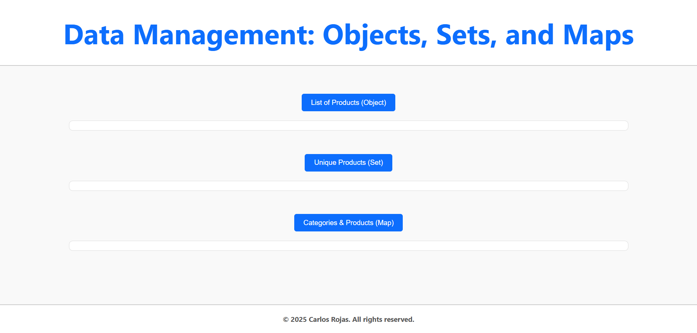

# Data Management: Objects, Sets, and Maps

🔗 **[Try it here!](https://carturo8.github.io/Data-Management-Objects-Sets-Maps/)**

This project is a basic JavaScript demonstration that shows how to manage and display data using different data structures: **Objects**, **Sets**, and **Maps**.

## 🚀 Features

- Displays a list of products using a JavaScript **Object**.
- Extracts unique product names using a **Set**.
- Assigns product categories using a **Map**.
- Responsive layout using **HTML** and **CSS**.
- Clear and clean user interface.

## 🖼️ Preview



## 🛠️ Technologies Used

- HTML5
- CSS3 (Flexbox)
- JavaScript (DOM manipulation)

## 📂 Project Structure

```bash
project-root/
│
├── README.md
├── LICENSE
├── index.html
├── assets/
│   ├── css/
│   │   └── styles.css
│   ├── js/
│   │   └── main.js
│   └── img/
│       └── preview.png
```

- `README.md`: Project documentation.
- `LICENSE`: License file (MIT).
- `index.html`: Main HTML structure.
- `assets/css/styles.css`: Custom styles and layout.
- `assets/js/main.js`: JS logic using Object, Set, and Map.
- `assets/img/preview.png`: UI preview image.

## ✅ How to Use

1. Clone the repository:
   ```bash
   git clone https://github.com/Carturo8/Data-Management-Objects-Sets-Maps
   ```

2. Open `index.html` in your browser.

3. Click the buttons to display different data structure outputs.


## 📄 License

This project is licensed under the MIT License – see the [LICENSE](https://github.com/Carturo8/Data-Management-Objects-Sets-Maps/blob/main/LICENSE) file for more details.
